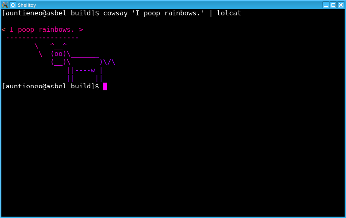
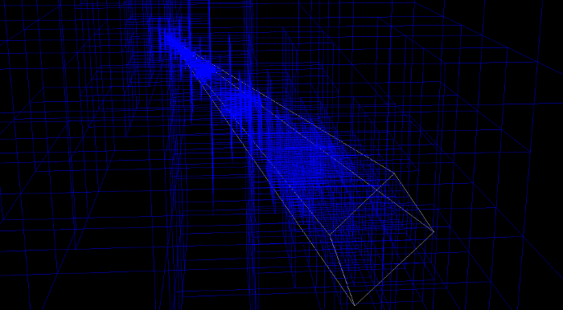
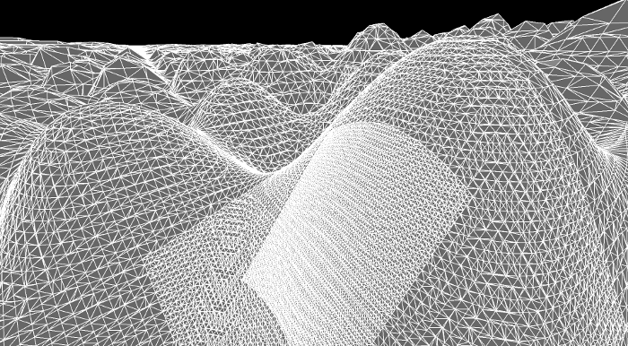
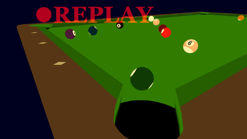
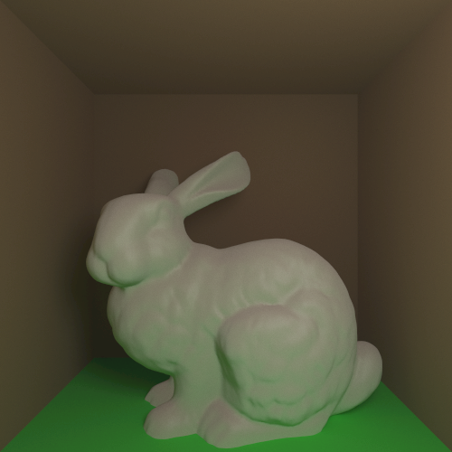

% 

##About Me
My name is Jonathan Glines. I am passionate about computer graphics as well as
C/C++ programming in general.

This website is where I organize/dump the things I have worked on or am
currently working on.

##Recent Projects

###[Shelltoy Terminal Emulator (WIP)](https://github.com/glines/shelltoy)

A graphically embellished terminal emulator inspired by both
[Shadertoy](https://www.shadertoy.com) and [GLSL
Sandbox](http://glslsandbox.com). Shelltoy would not have been possible without
[libtsm](https://www.freedesktop.org/wiki/Software/kmscon/libtsm/), the
terminal-emulator state machine library. Shelltoy uses OpenGL, SDL2, and
Freetype, among other libraries and APIs.

###[libmc Isosurface Extraction Library](https://github.com/glines/libmc)

An implementation of the marching cubes algorithm and related isosurface
extraction algorithms in C, with C++ bindings. Some algorithms implemented
include dual marching cubes [as described by
Nielson](http://dl.acm.org/citation.cfm?id=1034484) as well as a partial
implementation of [Eric Lengyel's Transvoxel
Algorithm](http://transvoxel.org/).

[A poster explaining libmc](./productions/libmc/poster.pdf) was created for the
[Idaho Conference on Undergraduate
Research](https://academics.boisestate.edu/icur/).

The libmc library was developed in conjunction with research on generalized
Voronoi diagrams performed by Dr. John Edwards at Idaho State University. Dr.
Edwards' research can be found on [his ISU faculty
page](http://www2.cose.isu.edu/~edwajohn/).

###[3D WebGL Billiards](./productions/billiards/billiards.html)
An undergraduate project as part of the Advanced Computer Graphics course at
Idaho State University. This project implements a fully playable billiards game
that should work in any web browser supporting WebGL. The game includes simple
ball and pocket physics, replays, intuitive mouse controls, and [sampled
distance field
text](http://www.valvesoftware.com/publications/2007/SIGGRAPH2007_AlphaTestedMagnification.pdf),
all developed within two weeks.

###[Ray Tracer with Global Lighting](https://github.com/auntieNeo/rt)
Another undergraduate project for the Advanced Computer Graphics course at ISU.
This is a ray tracer using Monte Carlo integration to approximate global
illumination. A k-d tree structure is used to intersect rays with arbitrary
meshes such as the Stanford Bunny model shown below.

<!--
##Site Map

###[Articles](./articles/index.html)
Articles, tutorials, and postmortems for problems I've worked on. Most of these
are articles for my own benefit, but if you find any of them helpful that's
even better. I try to make demos, example code, and printable PDF's along with
each article.

###[Productions](./productions/index.html)
A collection of projects and demos I have made.  Most of these are viewable in
any modern web browser, with more to come.

###[Blog](./blog/index.html)
This is where I will (eventually) write about personal things unrelated to
programming.
-->

##Contact
If you would like to contact me about anything, feel free to email me at
[jonathan@glines.net](mailto:jonathan@glines.net).
