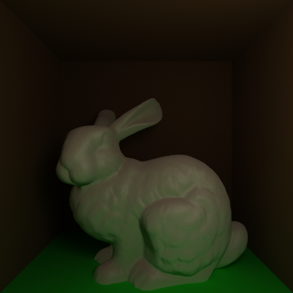

% Productions

## Projects

### [Bird Enumeration with Reference Boids](./berb.html)
Bird Enumeration with Reference Boids, abreviated "berb", is an experimental
testbed for counting birds using computer vision techniques. It simulates bird
flocks using the [boids flocking algorithm](http://www.red3d.com/cwr/boids/).

<!--
### [Pigs In Blankets Live](./pib.html)
Pigs In Blankets Live is a Linux live CD/USB based on NixOS that enables easy
automated testing of different builds of the [Mesa 3D Graphics
Library](http://www.mesa3d.org/) against the [Pilgit OpenGL Graphics Testing
Framework](http://people.freedesktop.org/~nh/piglit/).
-->

<!--
### Shelltoy
Shelltoy is a utility similar to [Shadertoy](https://www.shadertoy.com/), and
even closer to [GLSL Sandbox](http://glslsandbox.com/). Shelltoy is a terminal
emulator for graphics programmers. Changes in code are displayed in realtime.
-->

## Demos

### [Billiards](./billiards/billiards.html)
A two-week project for a graphics course that I took at Idaho State University.

### [Ray Tracing with Global Illumination](./rt/index.html)

